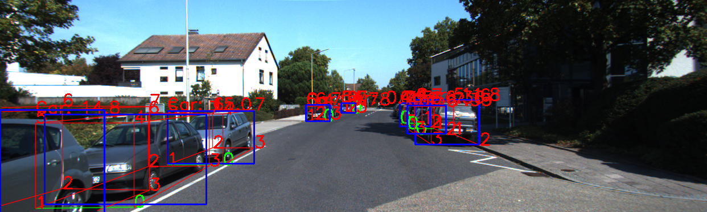
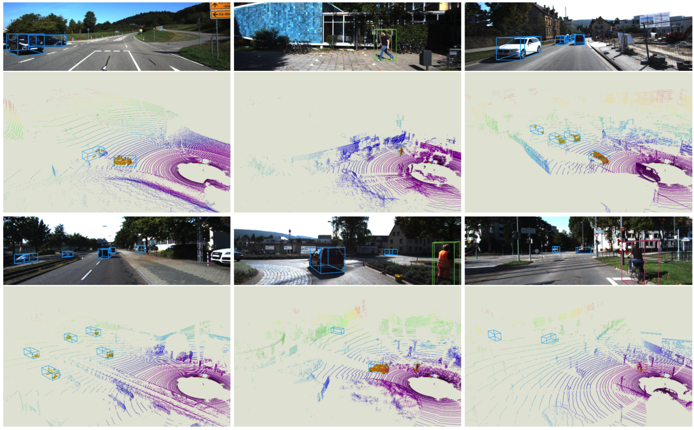

This repository is modified based on the monocular 3d object detection [monodle](https://github.com/xinzhuma/monodle), with the following main additions:
1. Support training and testing under torch1.7.0
2. Add a lightweight network, such as res18
3. Add support for truncation objects(modified from [monoflex](https://github.com/zhangyp15/MonoFlex))
4. Support torch DDP mode training, see [ddp branch](https://github.com/DuZzzs/monodleX/tree/ddp)

## usage

### Installation

We have observed that due to environmental differences, the performance fluctuates by 2 to 3 points. This code was tested under torch1.7.0, we recommend using requirements.txt for installation:

```
pip install -r requirements.txt
```

### modifications

We tested some monocular detection algorithms and found that many centernet-based algorithms rely on dcnv2, which is not good for model deployment. We also found that when the dcnv2 module is removed, the performance of the model drops very seriously, see. Monodle can get better performance without relying on dcnv2. But there is still a little distance from the actual application. We mainly made some modifications based on actual application requirements:
1. Add support for lightweight network
    The dla network is still too big for practical applications, and we have added a lighter network such as res18.

2. Add support for truncation targets.
    Most monocular 3D target detection algorithms cannot support the detection of truncated targets. We learn from the approach in monoflex to support truncated targets. In the experiment, it is found that because there are fewer truncated objects in the kitti dataset, although we can increase truncated targets through crop images, the performance of truncated targets still requires more data for training.

  

3. we also provide torch DDP mode for training, see ddp branch.

### performance

| backbone                                          | trunc obj | AP40@Easy | AP40@Mod. | AP40@Hard |
| ------------------------------------------------- | --------- | --------- | --------- | --------- |
| dla(original monodle)                             | no        | 17.9389   | 13.7197   | ,12.1020  |
| dla                                               | no        | 19.8052   | 14.7643   | 12.4731   |
| res18                                             | no        | 11.6040   | 9.3674    | 7.8279    |
| [res18](./experiments/example/test_kitti_v2.yaml) | yes       | 11.9599   | 9.5214    | 8.0274    |


Hope our work can help you.

-_-


---


# Delving into Localization Errors for Monocular 3D Detection

By [Xinzhu Ma](https://scholar.google.com/citations?user=8PuKa_8AAAAJ), Yinmin Zhang, [Dan Xu](https://www.danxurgb.net/), [Dongzhan Zhou](https://scholar.google.com/citations?user=Ox6SxpoAAAAJ), [Shuai Yi](https://scholar.google.com/citations?user=afbbNmwAAAAJ), [Haojie Li](https://scholar.google.com/citations?user=pMnlgVMAAAAJ), [Wanli Ouyang](https://wlouyang.github.io/).


## Introduction

This repository is an official implementation of the paper ['Delving into Localization Errors for Monocular 3D Detection'](https://arxiv.org/abs/2103.16237). In this work, by intensive diagnosis experiments, we quantify the impact introduced by each sub-task and found the ‘localization error’ is the vital factor in restricting monocular 3D detection. Besides, we also investigate the underlying reasons behind localization errors, analyze the issues they might bring, and propose three strategies. 




## Usage

### Installation
This repo is tested on our local environment (python=3.6, cuda=9.0, pytorch=1.1), and we recommend you to use anaconda to create a vitural environment:

```bash
conda create -n monodle python=3.6
```
Then, activate the environment:
```bash
conda activate monodle
```

Install  Install PyTorch:

```bash
conda install pytorch==1.1.0 torchvision==0.3.0 cudatoolkit=9.0 -c pytorch
```

and other  requirements:
```bash
pip install -r requirements.txt
```

### Data Preparation
Please download [KITTI dataset](http://www.cvlibs.net/datasets/kitti/eval_object.php?obj_benchmark=3d) and organize the data as follows:

```
#ROOT
  |data/
    |KITTI/
      |ImageSets/ [already provided in this repo]
      |object/			
        |training/
          |calib/
          |image_2/
          |label/
        |testing/
          |calib/
          |image_2/
```

### Training & Evaluation

Move to the workplace and train the network:

```sh
 cd #ROOT
 cd experiments/example
 python ../../tools/train_val.py --config kitti_example.yaml
```
The model will be evaluated automatically if the training completed. If you only want evaluate your trained model (or the provided [pretrained model](https://drive.google.com/file/d/1jaGdvu_XFn5woX0eJ5I2R6wIcBLVMJV6/view?usp=sharing)) , you can modify the test part configuration in the .yaml file and use the following command:

```sh
python ../../tools/train_val.py --config kitti_example.yaml --e
```

For ease of use, we also provide a pre-trained checkpoint, which can be used for evaluation directly. See the below table to check the performance.

|                   | AP40@Easy | AP40@Mod. | AP40@Hard |
| ----------------- | --------- | --------- | --------- |
| In original paper | 17.45     | 13.66     | 11.68     |
| In this repo      | 17.94     | 13.72     | 12.10     |

## Citation

If you find our work useful in your research, please consider citing:

```latex
@InProceedings{Ma_2021_CVPR,
author = {Ma, Xinzhu and Zhang, Yinmin, and Xu, Dan and Zhou, Dongzhan and Yi, Shuai and Li, Haojie and Ouyang, Wanli},
title = {Delving into Localization Errors for Monocular 3D Object Detection},
booktitle = {Proceedings of the IEEE/CVF Conference on Computer Vision and Pattern Recognition (CVPR)},
month = {June},
year = {2021}}
```

## Acknowlegment

This repo benefits from the excellent work [CenterNet](https://github.com/xingyizhou/CenterNet). Please also consider citing it.

## License

This project is released under the MIT License.

## Contact

If you have any question about this project, please feel free to contact xinzhu.ma@sydney.edu.au.
